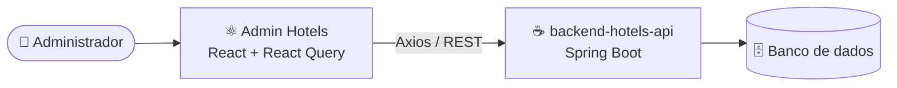

<div align="center">

# 🏨 Admin Hotels

### Painel administrativo para gerenciar hotéis e quartos


**Frontend** · [Ver API (Spring Boot)](https://github.com/joaoalexandre2/backend-hotels-api)

</div>

---

## ✨ Funcionalidades

| | |
|---|---|
| 🏨 **Hotéis** | Listagem, busca, cadastro, edição e exclusão |
| 🛏️ **Quartos** | Listagem, cadastro e edição, com filtro por hotel |
| 📊 **Dashboard** | Painel inicial de acesso rápido |
| 🔒 **Rotas protegidas** | Áreas do painel só abrem após o login |

## 🧩 Como funciona



## 🚀 Começando

Requisitos: Node.js 20+.

```bash
git clone https://github.com/joaoalexandre2/admin-hotes.git
cd admin-hotes
npm install
npm run dev
```

A URL da API está em [`src/api/client.ts`](src/api/client.ts). Para usar uma API local, troque a `baseURL`.

> ⚠️ **Login de demonstração.** A tela de login valida credenciais no próprio navegador e não usa autenticação real da API. Serve para mostrar o fluxo de rotas protegidas, e não deve ser usada em produção.

## 📜 Scripts

| Comando | O que faz |
|---|---|
| `npm run dev` | Servidor de desenvolvimento |
| `npm run build` | Checagem de tipos + build de produção |
| `npm run preview` | Pré-visualiza o build |
| `npm run lint` | Roda o ESLint |

## 📁 Estrutura

```
src/
├── api/          # cliente Axios
├── components/   # HotelCard, RoomCard, Sidebar
├── hooks/        # React Query: hotéis, quartos, auth
├── layouts/      # AdminLayout
├── pages/        # Login, Dashboard, Hotels, Rooms e formulários
├── routes/       # ProtectedRoute
└── style/        # estilos por tela
```

## 🔗 Backend

A API está em [joaoalexandre2/backend-hotels-api](https://github.com/joaoalexandre2/backend-hotels-api).

---

<div align="center">
Feito por <a href="https://github.com/joaoalexandre2">João Alexandre</a>
</div>
